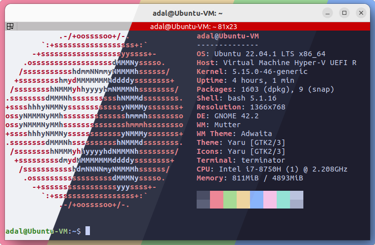

<h3 align="center">
	<br/>
	
	Catppuccin for <a href="https://github.com/gnome-terminator/terminator">Terminator</a>
	
</h3>

<p align="center">
    <a href="https://github.com/catppuccin/terminator/stargazers"></a>
    <a href="https://github.com/catppuccin/terminator/issues"></a>
    <a href="https://github.com/catppuccin/terminator/contributors"></a>
</p>

<p align="center">
  
</p>

## Usage

1. Copy the contents of the "catppuccin.config" file into your "~ /.config/terminator/config" file in the following manner:
```
[profiles]
  [[default]]
    # ..default profile
  [[Catppuccin_Flavour]]
    # ..Catppuccin profile
```
2. Open terminator and right click on the screen > `Profiles` and select the catppuccin profile of the flavour of your choice or `terminator -p Catppuccin_{Flavour}` where _{Flavour}_ can be `Latte, Frappe, Macchiato or Mocha`.
3. If you want you can also delete the "[[default]]" section and rename one of the Catppuccin profiles as "default" to use this profile as default.
## 💝 Thanks to

- [Rompicapo](https://github.com/Rompicapo)
- [Adal Zanabria](https://github.com/AdalZanabria)

&nbsp;

<p align="center"></p>
<p align="center">Copyright &copy; 2021-present <a href="https://github.com/catppuccin" target="_blank">Catppuccin Org</a>
<p align="center"><a href="https://github.com/catppuccin/catppuccin/blob/main/LICENSE"></a></p>
