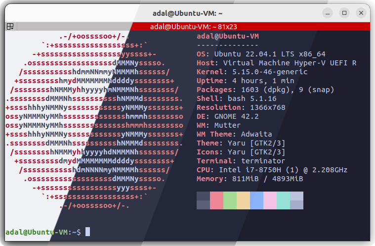
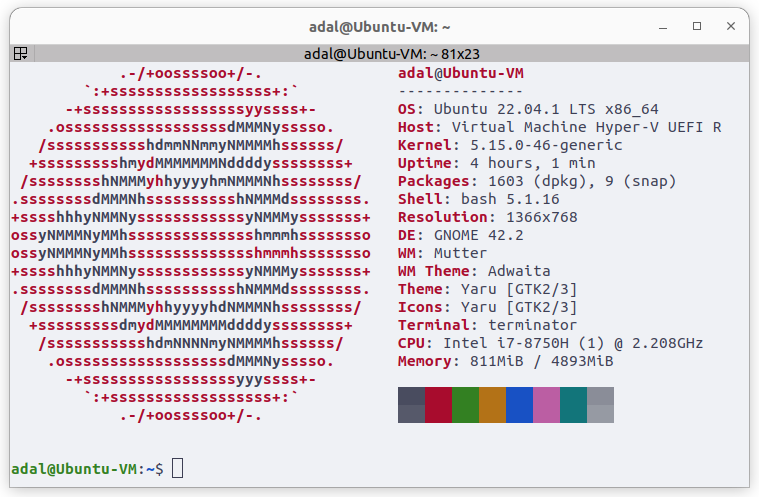
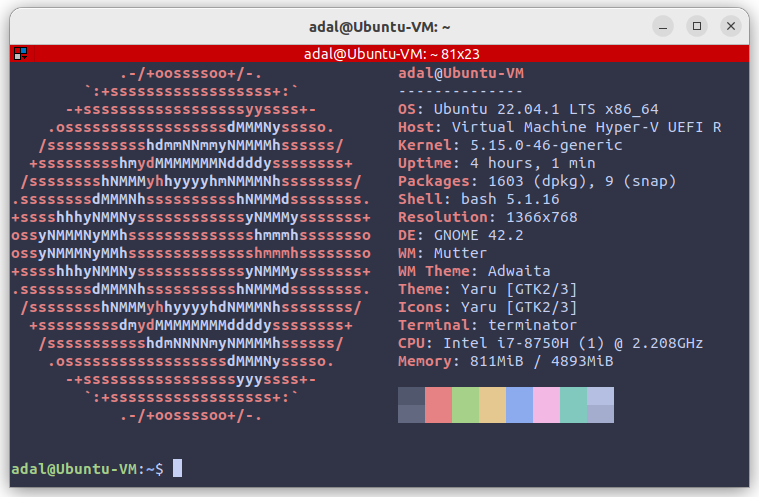
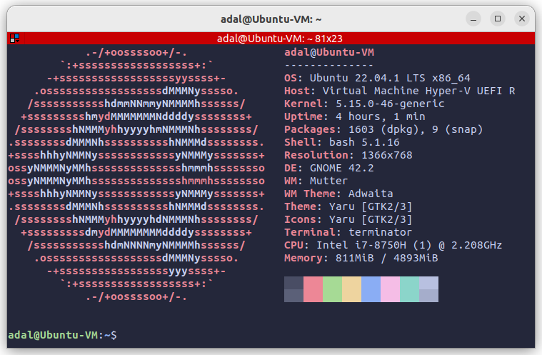
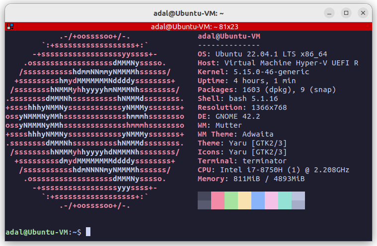

<h3 align="center">
	 
	
	Catppuccin for <a href="https://github.com/gnome-terminator/terminator">Terminator</a>
	
</h3>

	
	
	

	

## Previews

🌻 Latte

🪴 Frappé

🌺 Macchiato

🌿 Mocha

## Usage

1. Copy the contents of [`catppuccin.config`](./catppuccin.config) into your [Terminator configuration file](https://gnome-terminator.readthedocs.io/en/latest/advancedusage.html#the-config-file) (typically at `~/.config/terminator/config`), below the default profile.
2. Open Terminator and right click on the screen > `Profiles` and select the Catppuccin flavor of your choice or run `terminator -p Catppuccin_<flavor>` where `<flavor>` is one of `Latte`, `Frappe`, `Macchiato` or `Mocha`. Alternatively, you can delete the "[[default]]" section and rename one of the Catppuccin profiles as "default" to use this profile as default.

## 💝 Thanks to

- [Rompicapo](https://github.com/Rompicapo)
- [Adal Zanabria](https://github.com/AdalZanabria)

&nbsp;

	

	Copyright &copy; 2021-present <a href="https://github.com/catppuccin" target="_blank">Catppuccin Org</a>

	

